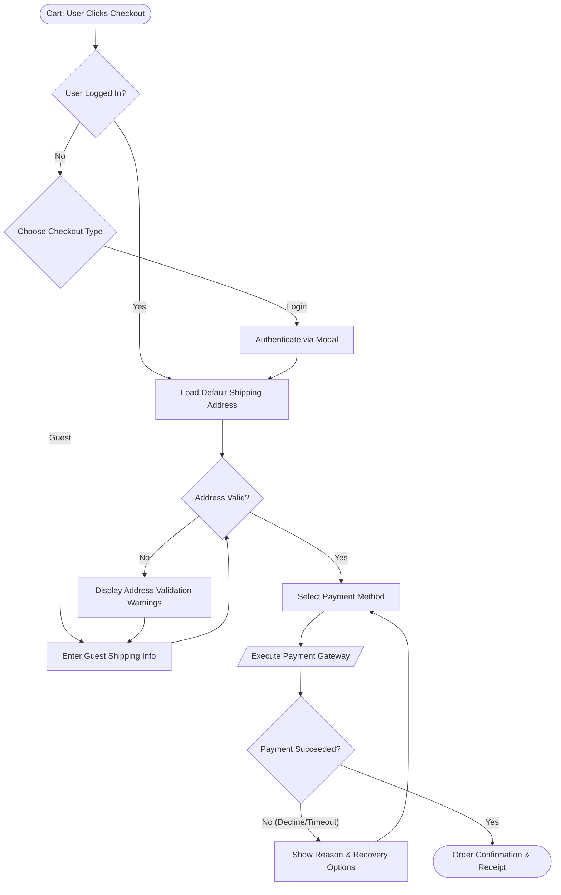

# Example User Flow: Multi-Step E-Commerce Checkout

## 1. Flow Overview
- **Flow ID**: `checkout-e2e-v1`
- **Objective**: Guide an authenticated or guest user through cart validation, address input, payment method selection, and order confirmation.
- **Key Invariants**: Zero dead ends, preserve payment details across failures, automatic session resumption.

---

## 2. Mermaid Flowchart

---

## 3. Transition Matrix

| Step ID | Current State | Trigger | Outcome | Fallback / Error Recovery |
| :--- | :--- | :--- | :--- | :--- |
| **01** | `Cart` | Click "Proceed to Checkout" | Evaluates auth state | N/A |
| **02** | `GuestOrLogin` | Selects "Guest Checkout" | Prompts for email & shipping | Retain cart items |
| **03** | `ShippingAddress` | Clicks "Continue to Payment" | Validates postal code & street | Inline field errors; focus moved |
| **04** | `Payment` | Submits payment details | Gateway processing | Keep address, allow alternate card |
| **05** | `OrderSuccess` | HTTP 200 from backend | Shows confirmation order # | Resend confirmation button |
