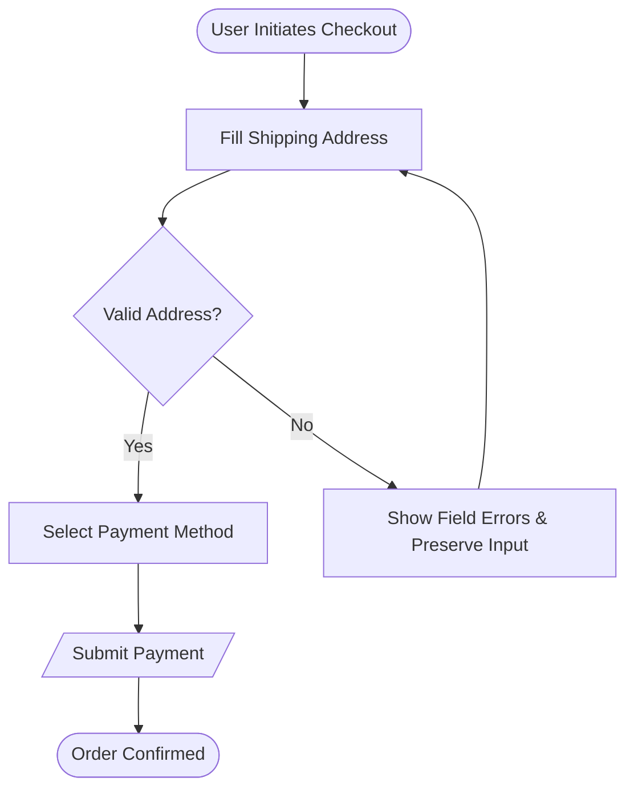

# User Flow Modeling & Task Architecture: Technical Reference Guide

## 1. Flow Taxonomy: Journey vs. Flow vs. Task vs. Wireflow

| Artifact | Scope | Level of Detail | Primary Purpose |
| :--- | :--- | :--- | :--- |
| **Customer Journey Map** | Macro | High-level (touchpoints, emotions, channels) | Strategic alignment across business & marketing |
| **User Flow** | Meso | Path across screens and decision forks | Engineering contracts, interaction logic |
| **Task Flow** | Micro | Single specific sub-task (e.g. upload avatar) | Linear step optimization |
| **Wireflow** | Visual | Screen wireframes linked by flow arrows | Visual layout context + interaction pathways |

---

## 2. Standardized Flowchart Notation (Mermaid)

### Shape Conventions
- **Rounded Rectangle / Stadium (`([Label])`)**: Entry point or final terminal state.
- **Rectangle (`[Label]`)**: Action or screen state.
- **Diamond (`{Label?}`)**: Decision fork (must have $\ge 2$ labeled outgoing branches).
- **Parallelogram (`[/Label/]`)**: User input or external system transaction.
- **Subroutine / Double Border (`[[Label]]`)**: Reusable sub-flow (e.g. Auth / 2FA).

---

## 3. Cognitive Load and Decision Friction Rules

1. **Hick's Law ($T = b \cdot \log_2(n + 1)$)**:
   - Decision time increases logarithmically with the number of choices.
   - In complex forms, split decisions into progressive disclosure steps rather than presenting 20 simultaneous choices on a single screen.
2. **Miller's Law ($7 \pm 2$)**:
   - Working memory capacity is bounded. Chunk complex multi-step wizards into 3 to 5 logical phases (e.g., Cart $\to$ Shipping $\to$ Payment $\to$ Review).
3. **The Peak-End Rule**:
   - Users evaluate an experience based on its most intense point (peak) and its final outcome (end).
   - Ensure final confirmation states are reassuring, provide immediate confirmation numbers, and suggest clear next steps.

---

## 4. Resilience Patterns for Error Recovery

### 4.1 Input Preservation
Never clear form fields on validation errors. Always preserve user-supplied values and highlight offending inputs inline with clear remediation text.

### 4.2 Graceful Degradation & Offline Queuing
For mobile or spotty network environments:
- Cache user actions locally in an offline mutation queue.
- Transition UI optimistically with a subtle pending sync indicator.
- Automatically retry requests with exponential backoff upon network restoration.

### 4.3 Safe Exit and Save-as-Draft
For workflows requiring more than 2 minutes of user effort:
- Provide an explicit "Save for Later" or auto-save mechanism.
- Allow users to resume directly from the saved step on any device.
