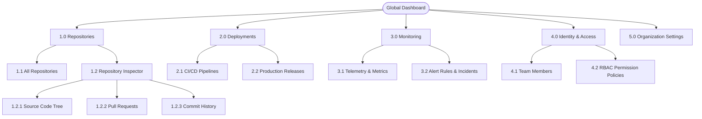

# Enterprise Platform Information Architecture & Sitemap Model

## 1. Hierarchy Overview & Metrics
- **Platform**: Cloud Developer Platform
- **Top-Level Categories**: 5 items (Dashboard, Repositories, Deployments, Monitoring, Settings)
- **Maximum Tree Depth**: 3 levels
- **Orphaned Views**: 0

---

## 2. Mermaid Structural Sitemap



---

## 3. Wayfinding & Breadcrumb Specifications

When navigating to a specific Pull Request (`PR #142`):
```text
Home / Repositories / prumo-core / Pull Requests / #142: Fix Memory Arena
```

HTML Implementation Contract:
```html
<nav aria-label="Breadcrumb">
  <ol class="flex items-center space-x-2 text-sm text-gray-600">
    <li><a href="/" class="hover:underline">Home</a></li>
    <li aria-hidden="true">/</li>
    <li><a href="/repos" class="hover:underline">Repositories</a></li>
    <li aria-hidden="true">/</li>
    <li><a href="/repos/prumo-core" class="hover:underline">prumo-core</a></li>
    <li aria-hidden="true">/</li>
    <li><a href="/repos/prumo-core/pulls" class="hover:underline">Pull Requests</a></li>
    <li aria-hidden="true">/</li>
    <li><span aria-current="page" class="font-semibold text-gray-900">#142: Fix Memory Arena</span></li>
  </ol>
</nav>
```
