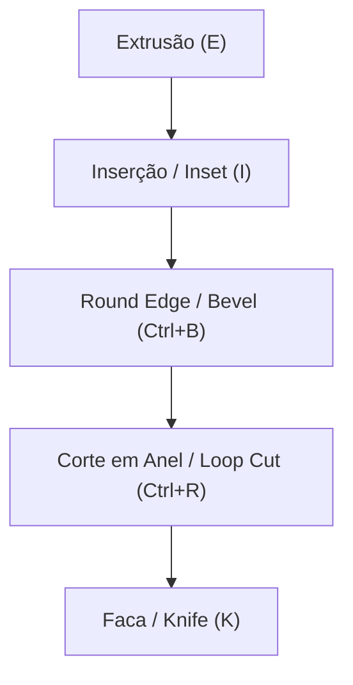

# Fluxo de Modelagem

O Petunia3D adota uma filosofia **Shape-First**: você começa com volumes e proporções sólidas bem definidas e adiciona detalhes através de cortes e extrusões atômicas.

---

## 1. Filosofia de Ativação de Ferramentas: Toque Único vs. Duplo Toque

As ferramentas de transformação (`G`, `R`, `S`) e de modelagem (`E` para extrusão, `I` para inset, `Ctrl+B` para bevel/round edge, etc.) compartilham a mesma ergonomia no Petunia3D:

1. **Toque Único (1 toque no atalho)**: Ativa a ferramenta com seu card flutuante de opções e gizmos de manipulação direta no viewport, mantendo o ponteiro do mouse livre para inspeção e ajustes finos.
2. **Duplo Toque Rápido (2 toques no atalho)**: Entra no **Modo Livre** modal (estilo Blender), no qual o movimento livre do mouse altera o valor/distância interativamente em tempo real:
   - O intervalo de tempo para duplo toque é configurável em **Preferências** (padrão: 350 ms).
   - O cursor se adapta contextualmente à ferramenta (`ns-resize` para extrude/push-pull, `nesw-resize` para bevel, `nwse-resize` para inset, etc.).
   - O pill flutuante no topo do viewport exibe `[MODO LIVRE]`, o valor atual e os comandos contextuais.
3. **Entrada Numérica Direta**: Digite o valor exato no teclado a qualquer momento durante a operação (ex: `1.5` ou expressões aritméticas simples) para fixar a distância ou ângulo.
4. **Confirmação e Cancelamento**:
   - Para confirmar: clique com o botão esquerdo (`LMB`) ou pressione `Enter`;
   - Para cancelar: clique com o botão direito (`RMB`) ou pressione `Escape` — a malha retorna instantaneamente ao estado original sem poluir o histórico.

---

## 2. Ferramentas Primárias de Modelagem

- **Extrusão (`E`)**: Duplica os elementos selecionados e os projeta ao longo da normal da face ou de um eixo travado.
- **Inserção / Inset (`I`)**: Cria um anel de novas faces recuadas dentro da face selecionada, ideal para criar molduras e painéis.
- **Round Edge / Bevel (`Ctrl+B`)**: Arredonda ou suaviza quinas e arestas vivas. O Core V1 prioriza **1 segmento**; múltiplos segmentos são recurso avançado.
- **Corte em Anel / Loop Cut (`Ctrl+R`)**: Insere um anel de arestas contínuo através de faces quadrangulares com deslizamento interativo.
- **Faca / Knife (`K`)**: Permite desenhar cortes livres conectando vértices e arestas com precisão de clique a clique.
- **Push / Pull**: Empurra ou puxa a geometria selecionada mantendo a planaridade adjacente.

---

## 3. Sistema de Undo / Redo Transacional

- **Desfazer**: `Ctrl+Z`
- **Refazer**: `Ctrl+Shift+Z` ou `Ctrl+Y`

Cada checkpoint é gravado de forma atômica. Cancelamentos com `Esc` durante qualquer operação jamais poluem a pilha de histórico.
