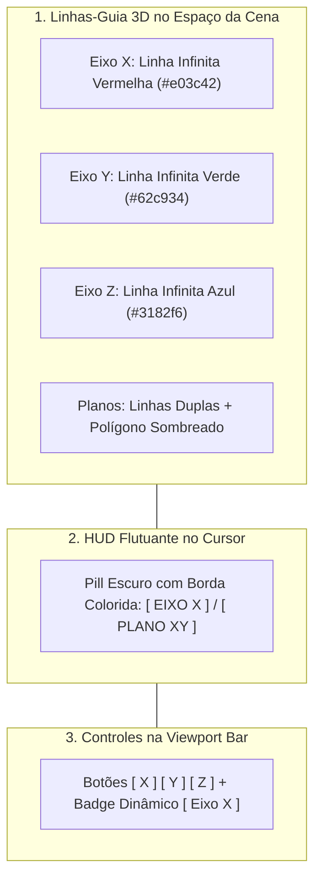

# Viewport 3D & Câmera

O **Viewport 3D** é o coração da experiência interativa do Petunia3D. Ele combina renderização acelerada por GPU, navegação orbital suave e um sistema de feedback em três camadas para transformações geométricas.

---

## 1. Navegação da Câmera

| Ação de Navegação | Mouse | Atalho Alternativo |
| :--- | :--- | :--- |
| **Órbita 3D** | Clique e arraste com o botão do meio (`MMB`) | `Alt + LMB` |
| **Panorâmica (Pan)** | Segure `Shift` + clique e arraste com `MMB` | `Shift + Alt + LMB` |
| **Zoom** | Roda de rolagem (`Scroll`) | `Ctrl + MMB` |
| **Enquadrar Seleção** | `Numpad .` (Ponto no teclado numérico) | Tecla `.` |
| **Vistas Ortográficas** | `Numpad 1` (Frontal), `Numpad 3` (Direita), `Numpad 7` (Superior) | Botões no Gizmo de Navegação |
| **Alternar Perspectiva / Ortográfica** | `Numpad 5` | Ícone de grade no Gizmo de Navegação |

---

## 2. Indicação Visual de Travamento de Eixos & Planos

Durante qualquer atividade de edição (como Mover `G`, Rotacionar `R`, Escalar `S` ou arrastar eixos de gizmos), você pode restringir o movimento a um eixo cartesiano ou plano coordenado. O Petunia3D fornece **feedback imediato em três camadas visuais coordenadas**:

### Como Ativar e Alternar:
- Pressione `X`, `Y` ou `Z` para travar o movimento no respectivo eixo cartesiano;
- Pressione `Shift+X` (Plano YZ), `Shift+Y` (Plano XZ) ou `Shift+Z` (Plano XY) para travar a transformação no plano perpendicular;
- Pressione a mesma tecla novamente para destravar e retornar à movimentação livre (`[ 🔓 LIVRE ]`);
- Você também pode clicar diretamente nos botões `[ X ]`, `[ Y ]`, `[ Z ]` na barra da viewport para travar ou pré-configurar os eixos antes de iniciar uma edição.

---

## 3. Modos de Sombreamento (Viewport Shading)

Os **modos-base** da V1 ficam no canto superior direito da Viewport Bar. Overlays são composição sobre o modo-base, não modos adicionais:

1. **Wireframe (`Z`)**: desenha apenas as arestas da malha, sem preenchimento. Útil para selecionar componentes internos.
2. **Solid**: sombreamento opaco padrão, com iluminação direcional difusa (Flat por default).
3. **Textured**: exibe cores de material e texturas atribuídas aos polígonos.
4. **Silhouette**: comparação direta entre modelo e referência, com a malha em silhueta.

`Unlit` está disponível na V1 como opção secundária de visualização/material. Flat é o default; Smooth é opção secundária.

---

## 4. Modo Raio-X (X-Ray)

Pressione `Alt+Z` para ativar ou desativar o **Modo Raio-X**:
- As faces se tornam semitransparentes (`alpha ~ 0.45`), permitindo enxergar a geometria traseira;
- O algoritmo de picking passa a permitir selecionar `Point` e `Edge` que estejam ocluídos atrás de superfícies sólidas.

---

## 5. O 3D Cursor

O cursor tridimensional é representado por uma mira circular vermelha e branca:
- **Posicionamento**: Segure `Shift` e clique com o botão direito (`Shift + RMB`) em qualquer ponto da malha ou do grid;
- **Utilidade**: Novas primitivas geométricas adicionadas à cena são geradas exatamente na coordenada do 3D Cursor.
- **Redefinição**: Pressione `Shift+C` para centralizar o cursor 3D de volta na origem `(0, 0, 0)`.

---

## 6. Inspeção de Triangulação & Inversão de Diagonal (Flip Diagonal)

Mesmo que o Petunia3D adote polígonos quadrangulares e n-gons para modelagem limpa, GPUs exigem triângulos para renderização e exportação.

- **Toggle de Triangulação**: Clique no botão de corte diagonal na Viewport Bar (ao lado do Raio-X) para inspecionar em tempo real as diagonais internas de corte fan de todos os quads e n-gons em tom azul suave (`#4da6f4`);
- **Inverter Diagonal (`Flip Diagonal`)**: Selecione um quad ou uma aresta compartilhada por dois triângulos e acione **Flip Diagonal** no menu contextual de malha para inverter a direção do corte mantendo winding, normais e integridade topológica;
- **Revolução de Perfis (`Revolve`)**: Converta polilinhas 2D ou perfis abertos em sólidos de revolução 360° com subdivisão configurável através de **Revolve Selection** no menu contextual de malha.

---

## 7. Feedback Visual da Viewport: HUD Pill & Cursores Contextuais

Para máxima clareza durante a modelagem:
- **HUD Pill Central**: No topo do viewport, uma pílula flutuante exibe a ferramenta ativa, o modo em execução (`[CARD / GIZMO]` quando ativada com 1 toque, ou `[MODO LIVRE]` com 2 toques rápidos) e as instruções de teclado e mouse.
- **Cursores Contextuais**: O ponteiro do mouse se transforma de acordo com a operação ativa:
  - `ns-resize`: Extrude, Extrude Individual, Push/Pull.
  - `nesw-resize`: Bevel (Round Edge), Scale.
  - `nwse-resize`: Inset.
  - `grabbing`: Rotate (Órbita de rotação de elementos).
  - `move`: Move / Transformação de posição.
  - `crosshair`: Faca (Knife), Fatiador (Slice), Corte em Anel (Loop Cut), Perfil 2D, Medição (Measure), Pintura (Paint).

---

## 8. Wireframe Overlay & Tag de Medição de Múltiplas Arestas

- **Wireframe Overlay**: Habilitado por padrão no Petunia3D, exibe a malha poligonal translúcida sobre os modelos sólidos, garantindo clareza topológica imediata sem precisar alternar para o modo Wireframe total.
- **Medição Rápida de Arestas**: Ao selecionar uma aresta, sua dimensão métrica exata é projetada no viewport. Quando múltiplas arestas estão selecionadas simultaneamente, o sistema projeta uma única tag flutuante no ponto médio / centroide da seleção indicando o comprimento médio (`Ø X.XXXm`), permitindo inspecionar proporções globais sem poluição visual. Essa funcionalidade pode ser ligada ou desligada no menu **Preferências** (`multiselection_measure_tag`).

